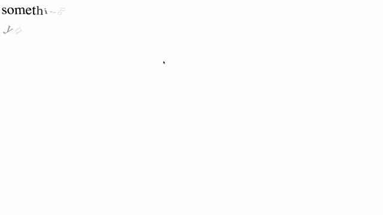

## textify.js
Add fancy animation/effects to letters.

1. requires Jquery, TweenMax.
2. manually tested to work on latest version of Chrome, Firefox, Safari and IE.


## Demo


Demo link at http://htmlpreview.github.io/?https://github.com/simboonlong/textify.js/blob/master/index.html


## Usage

Import the textify.css styles. Follow the structure in index.html.
```
<div id="split-1" class="split">something cool is coming</div>
<div id="split-2" class="split">yup this is awesome</div>
```


Basic options in textify.js are:

```
var splitOne = new SplitText( $('#split-1') );
splitOne.init().animate({
    delay: 0,
    x: 10,
    y: 20,
    rotationX: 165,
    rotationY: 40,
    rotationZ: 20,
    duration: 1.3,
    opacity: 0,
    staggerDuration: 0.1,
    easeType : Back.easeOut
});

```

Refer to TweenMax documentation for more information.


## License
textify.js is licensed under the MIT license. (http://opensource.org/licenses/MIT)


## Contributing
Feel free to contribute.